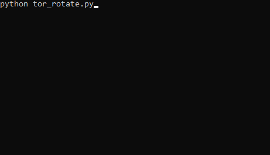

# RotaTor

### Script to rotate through Tor identities, you can add your own code in between.

* Usage:
python rotaTor.py  

## Attention:
* To make this work, you need to add the following lines to your "torrc" file:  
`ControlPort 9051`  
`CookieAuthentication 1`

* You can find the file here:  
if you compiled tor from source:  
`/usr/local/etc/tor/torrc`  
if you installed a pre-built package:  
`/etc/tor/torrc or /etc/torrc`  
fallback location if above file is not found:  
`$HOME/.torrc` 
on windows in TorBrowser folder:  
`\Tor Browser\Browser\TorBrowser\Data\Tor\torrc`
